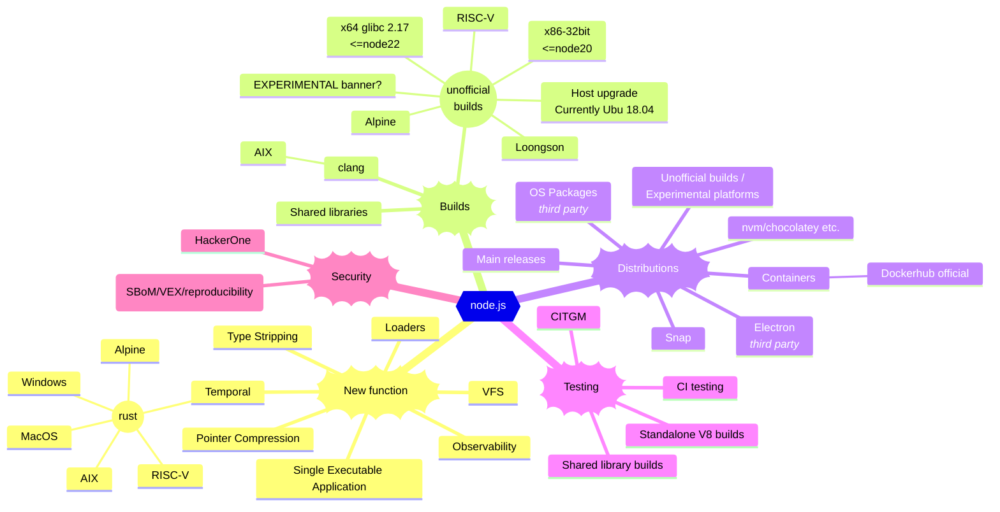

```mermaid
mindmap
  root{{node.js}}
    ))New function((
      Temporal
        ((rust))
          AIX
          RISC-V
          Alpine
          MacOS
          Windows
      Single Executable Application
      VFS
      Pointer Compression
      Loaders
      Observability
      Type Stripping
    ))Builds((
      clang
        AIX
      ((unofficial<br/>builds))
        Alpine
        RISC-V
        Loongson
        x64 glibc 2.17<br/><=node22
        x86-32bit<br/><=node20
        Host upgrade<br/>Currently Ubu 18.04
        EXPERIMENTAL banner?
      Shared libraries
    ))Distributions((
      Main releases
      Unofficial builds /<br/>Experimental platforms
      Containers
        Dockerhub official
      Snap
      OS Packages<br/>_third party_
      nvm/chocolatey etc.
      Electron<br/>_third party_
    ))Testing((
      CI testing
      CITGM
      Standalone V8 builds
      Shared library builds
    ))Security((
      HackerOne
      Supply chain security<br/>(SBoM/VEX/reproducibility)
```